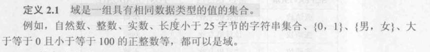
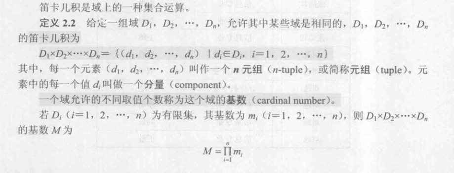
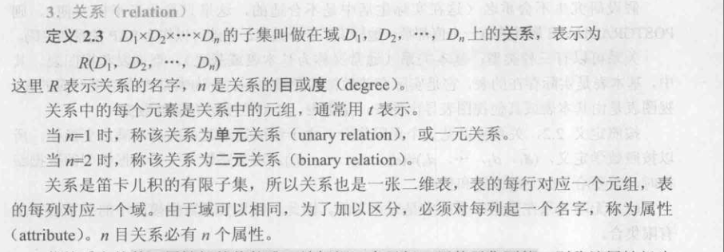
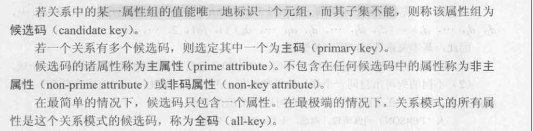
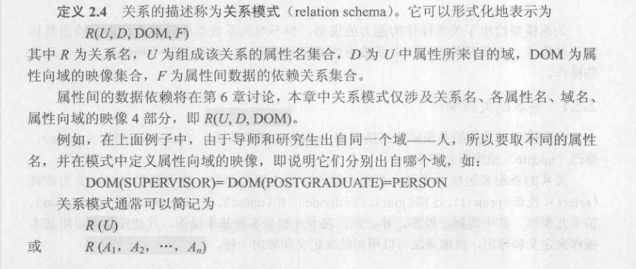

1. 域（`domain`）

> 

2. 笛卡儿积（`cartesian product`）

> * 注意：笛卡儿积的基数等于参与笛卡儿积的各个域的基数的乘积。
> 
> 

3. 关系（`relation`）

> * 注意：关系即多个集合排列组合，每个集合具有相同数据类型的值。换句话说：笛卡尔积的有限子集
> 
> 

4. 码（`key`)

> * 注意：候选码是指的一组属性
>
> 

5. 关系模式（`relation schema`)

> * 注意：关系模式是对关系的形式化定义和结构化描述
>
> 
